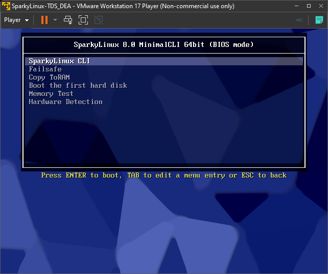
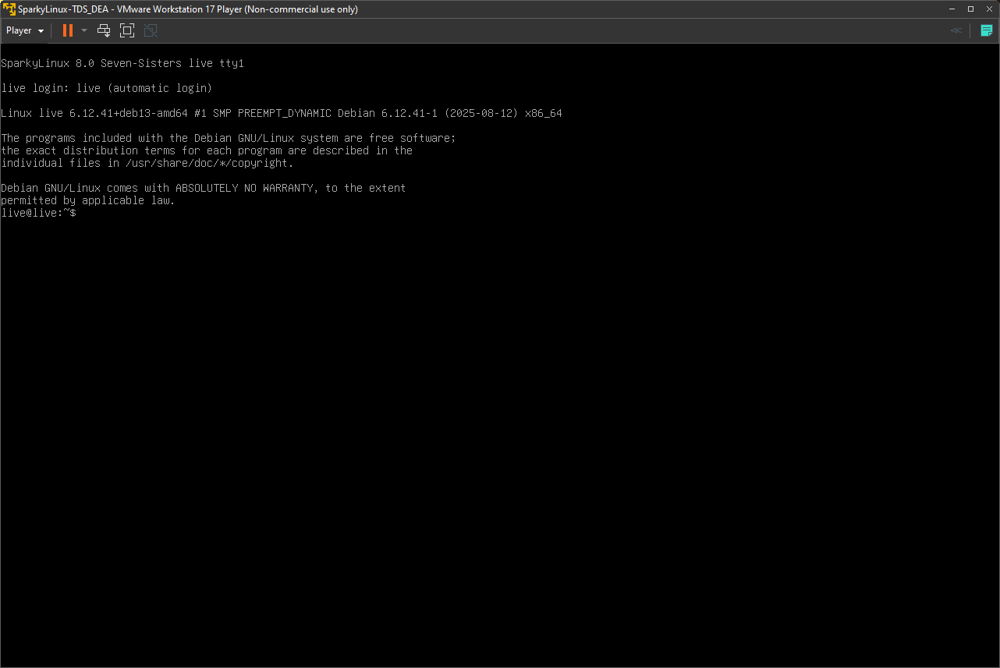
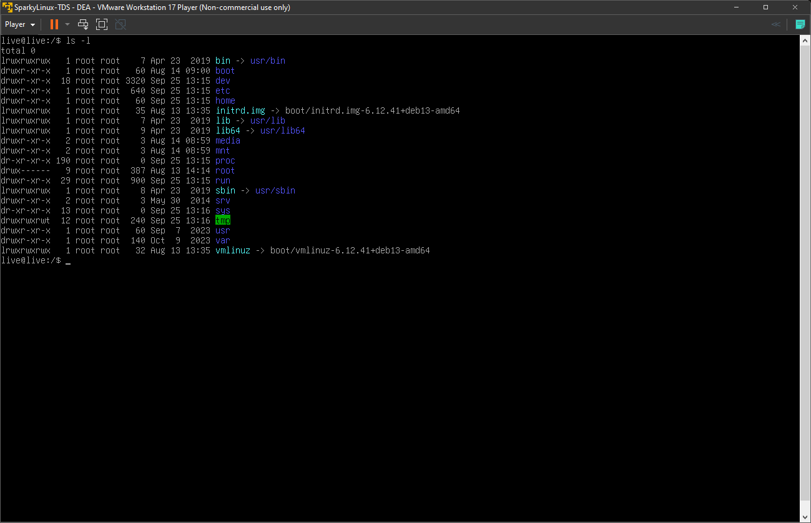
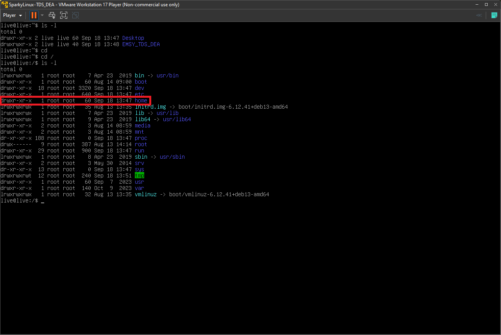
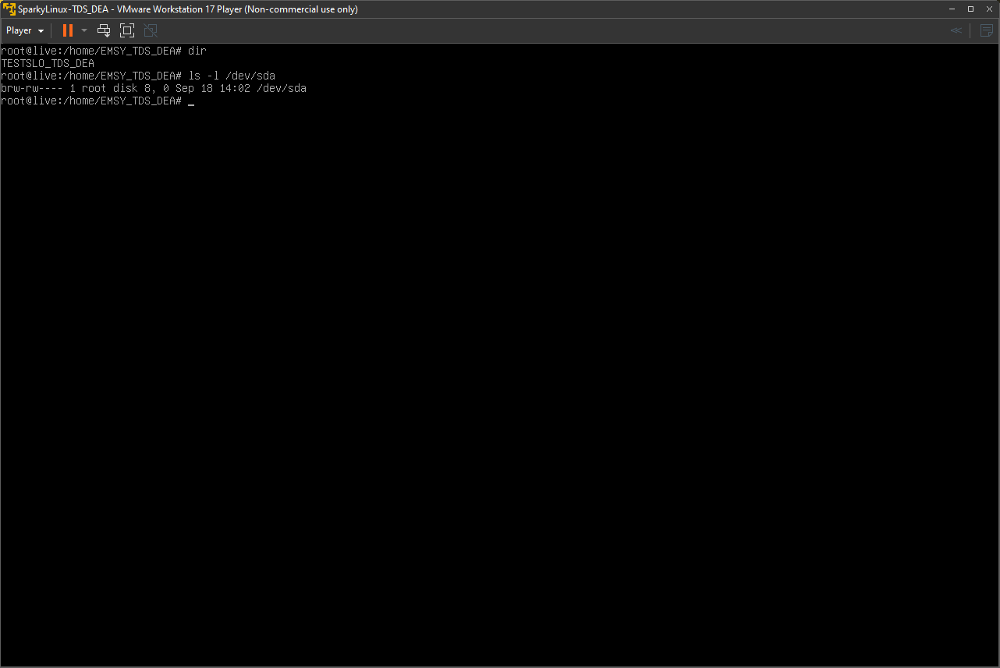

# TP1 - Installation Linux sur une VM - V0.1

## Groupe 

- TDS - DEA 

## But 

Cette manipulation a pour but d'installer une distribution linux [Sparky Linux](https://sparkylinux.org/) dans une machine virtuelle VMware Workstation Player, à l’aide d’une image disque (ISO).

## Materiels à disposition 

- VMware Workstation Player - V17
- Image disque (ISO) : sparkylinux-6.4-x86_64-minimalcli.iso

## Creation d'une machine virtuel

A. Lancez VMware Workstation Player 17 (logiciel)  

B. Sélectionnez **Create a New Virtual Machine** 

C. Le fichier `.iso` le l'instalation Linux est plancé dans le repertoire `C:\TDS\VM\ISO`

D. Indiquez le chemin d’accès de l’image iso comme indiqué sous l’image ci-dessous :

 

E. Choisir un nom d'OS : `Linux - Debian 11.x` 

 

F. Nom de la machine virtuelle : `SparkyLinux-TDS_DEA` 

G. Creez un disque virtuel -> capcité : **20GB** et cocher **store virtual disk a single file**

 

## Voici la configuration de la VM 

 

H. Lancez la machine virtuelle : **Play virtual machine** 

## Lancement de l'image ISO (Linux - Live CD) 

G. Lancement du live CD : 

 

Shell Linux : 

 

> **ATTENTION** : par défaut, le clavier est configuré est **Clavier Americain**

Q1. disposition du clavier américain ?

> QWERTY

Q2. disposition du clavier suisse-romand ?

> QWERZ

Q3. disposition du le clavier français ? 

> AZERTY

H. Déplacez-vous à la **racine du système** en utilisant la commande suivante : `cd` 

> pour se déplacer a la racine on va utilser "cd /" le "/" représentant la racine.

I. Affichez le contenu de la racine avec la commande : `ls –l`	

 

Q5. Que signifie l'option `-l` avec la commande `ls` 

> la commande ls de base sert à faire un listing du repertoir dans lequel on est, si on utilise l'option "l" (long), sa affichera en plus des détail comme le type, permissions, propriétaire, groupe, taille, dates.

Q6. Décrypter la ligne où se trouve le répertoire **home**    

> Le « d » au début veut dire que c’est un dossier, le « r » signifie que l’on peut lire le contenu, le « w » signifie que l’on peut modifier le contenu et « x » signifie que l’on peut exécuter le contenu. Dans ce cas de la ligne « drwxr-xr-x », elle permet de dire que tout le monde peut accéder au répertoire et lire son contenu, mais seul le créateur peut le modifier.

>Le « 1 » après cette ligne décrit le nombre de liens physiques au dossier.

>Le premier « root » décrit le propriétaire du dossier.

>Le second « root » décrit le groupe propriétaire du dossier.

>Le « 60 » représente la taille en octets du contenu du dossier.

>Le « sep 18 13:47 » représente la date et l’heure de la dernière modification.

>Le « home » est le nom du dossier.

J. Créez un répertoire de travail nommé « EMSY_VosInitiales» dans quel dossier racine allez-vous le placer (justifiez votre réponse) et quelle commande allez-vous utiliser. 

> On va utiliser la commande "sudo su" pour passer en super utilisateur et pouvoir éditer le dossier home.

> Ensuite, on va utiliser la commande "cd home/" pour se déplacer dans le dossier home.

> Ensuite, on utilise "mkdir EMSY_TDS_DEA" pour créer un dossier dans le répertoire home.

> Nous avons choisi le répertoire home car il est décrit dans Linux comme un répertoire personnel.

Q7. Si vous créez un répertoire de travail (pour éditer/sauvegarder des fichiers), dans quelle **répertoire racine** vous vous placez ? 

Dans le répertorie home car ce répertoire est reserver pour des dossiers personnels.

K. Dans ce répertoire, créez un fichier texte que vous nommerez `TESTSLO_XXX_XXX` et éditez celui en écrivant un texte, exemple : "TP linux by XXX et XXX".
	Utiliser la commande `vi`

> Nous allons tapez "vi TESTSLO_TDS_DEA" pour créé un fichier.
> Activer le mode insertion → i et taper le texte, ensupte pour, faire echappe pour quitter le mode insertion et faire "ZZ" pour enregister et quitter.

Q9. dans le répertoire `/home`, pouvez-vous éditez un fichier uniquement avec la commande `vi` 

> Faux, on peut utiliser la commande nano, qui est également un éditeur de texte (plus simple d’utilisation).

Q10. Si vous éteignez la machine virtuelle et que vous la rallumez, est-ce que le répertoire créé ci-dessus existe toujours (justifiez votre réponse) ? 

> Non, car toutes les modifications sont pour l’instant sauvegardées dans la RAM et pas sur le disque, ce qui fait qu’une fois la machine éteinte, tout est perdu.

L. Tapez la commande `ls -l /dev/sda` 

 

Q11. Que signifie **sda** ? 

> C’est le nom par défaut que Linux donne aux disques détectés. Par exemple, le premier disque s’appelle /dev/sda, le deuxième /dev/sdb, etc.

Q12. Décrypter la réponse après avoir taper la commande `ls -l /dev/sda` -> voir résultat point 13.

> le "ls -l" sert a faire un listing avec l'option "l" les affichera les détail comme le type, permissions, propriétaire, groupe, dates et "/dev/sda" fait référence au premier disque dur détecté par Linux

## Tips 

> $$Tips^1$$ : sortir de la VM -> appuyer simultanément sur `Ctrl` et `Alt` 

> $$Tips^2$$ : arrêter la VM proprement -> commande : `shutdown`

> $$Tips^3$$ : arrêter la VM pour cause de plantage -> commande : `halt` ou `poweroff`

> $$Tips^4$$ : [commande vi avec ses options](https://www.linuxtricks.fr/wiki/guide-de-sur-vi-utilisation-de-vi)

> $$Tips^5$$ : [éditer un fichier type markdown (.md)](https://ashki23.github.io/markdown-latex.html)

