# TP1 - Installation Linux sur une VM - V0.1

## Groupe 

- TDS - DEA 

## But 

Cette manipulation a pour but d'installer une distribution linux [Sparky Linux](https://sparkylinux.org/) dans une machine virtuelle VMware Workstation Player, à l’aide d’une image disque (ISO).

## Materiels à disposition 

- VMware Workstation Player - V17
- Image disque (ISO) : sparkylinux-6.4-x86_64-minimalcli.iso

## Creation d'une machine virtuel

A. Lancez VMware Workstation Player 17 (logiciel)  

B. Sélectionnez **Create a New Virtual Machine** 

C. Le fichier `.iso` le l'instalation Linux est plancé dans le repertoire `C:\TDS\VM\ISO`

D. Indiquez le chemin d’accès de l’image iso comme indiqué sous l’image ci-dessous :

 

E. Choisir un nom d'OS : `Linux - Debian 11.x` 

 

F. Nom de la machine virtuelle : `SparkyLinux-TDS_DEA` 

G. Creez un disque virtuel -> capcité : **20GB** et cocher **store virtual disk a single file**

 

## Voici la configuration de la VM 

 

H. Lancez la machine virtuelle : **Play virtual machine** 

## Lancement de l'image ISO (Linux - Live CD) 

G. Lancement du live CD : 

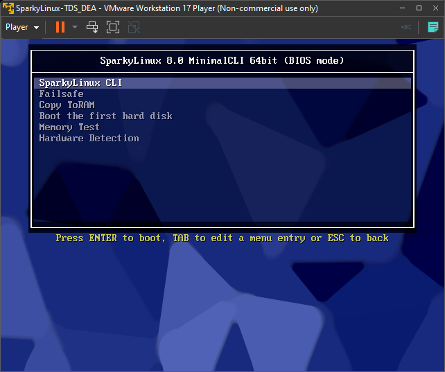 

Shell Linux : 

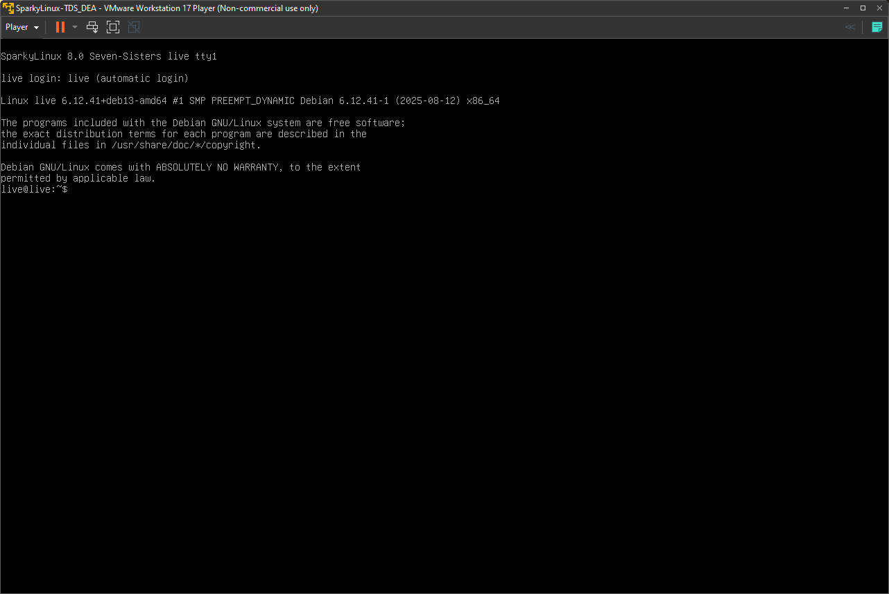 

> **ATTENTION** : par défaut, le clavier est configuré est **Clavier Americain**

Q1. disposition du clavier américain ?

> QWERTY

Q2. disposition du clavier suisse-romand ?

> QWERZ

Q3. disposition du le clavier français ? 

> AZERTY

H. Déplacez-vous à la **racine du système** en utilisant la commande suivante : `cd` 

> pour se déplacer a la racine on va utilser "cd /" le "/" représentant la racine.

I. Affichez le contenu de la racine avec la commande : `ls –l`	

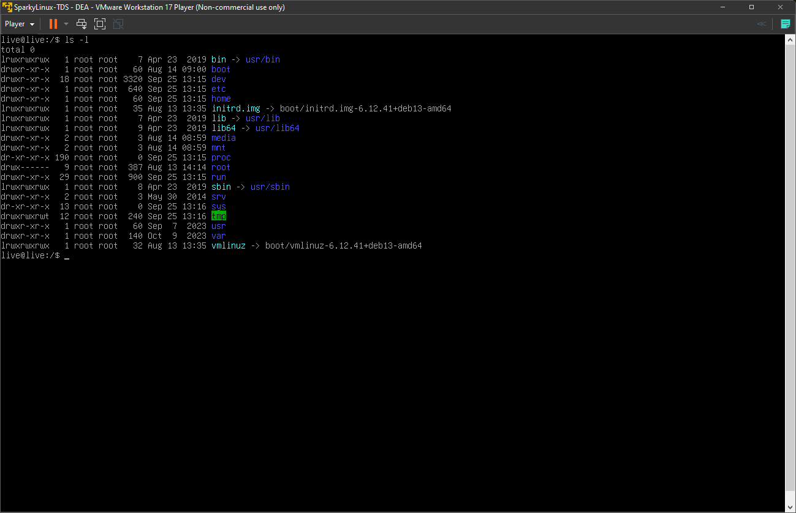 

Q5. Que signifie l'option `-l` avec la commande `ls` 

> la commande ls de base sert à faire un listing du repertoir dans lequel on est, si on utilise l'option "l" (long), sa affichera en plus des détail comme le type, permissions, propriétaire, groupe, taille, dates.

Q6. Décrypter la ligne où se trouve le répertoire **home**    

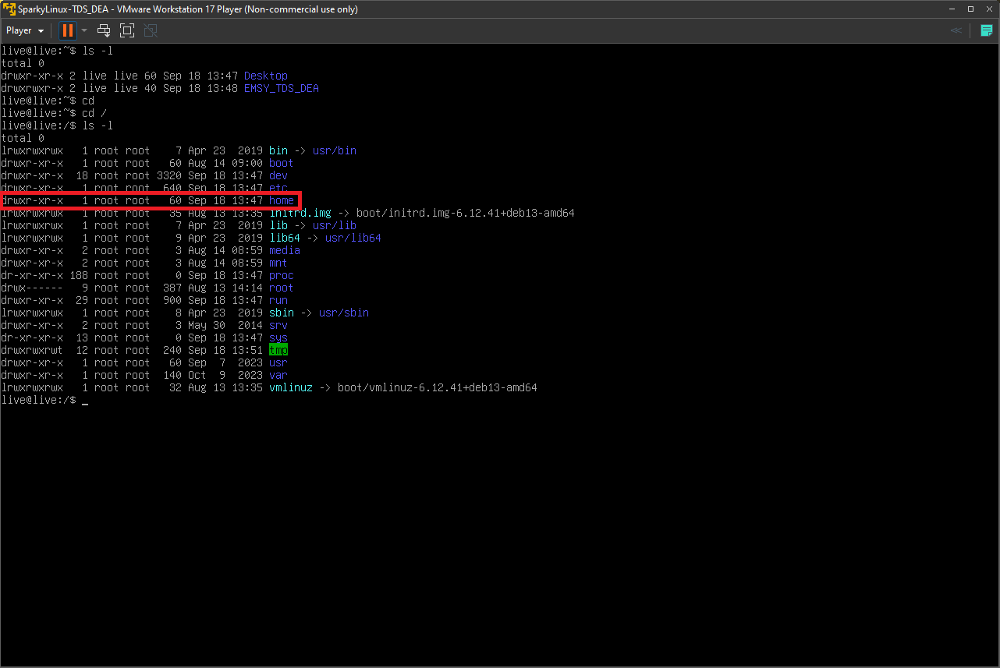

> Le « d » au début veut dire que c’est un dossier, le « r » signifie que l’on peut lire le contenu, le « w » signifie que l’on peut modifier le contenu et « x » signifie que l’on peut exécuter le contenu. Dans ce cas de la ligne « drwxr-xr-x », elle permet de dire que tout le monde peut accéder au répertoire et lire son contenu, mais seul le créateur peut le modifier.

>Le « 1 » après cette ligne décrit le nombre de liens physiques au dossier.

>Le premier « root » décrit le propriétaire du dossier.

>Le second « root » décrit le groupe propriétaire du dossier.

>Le « 60 » représente la taille en octets du contenu du dossier.

>Le « sep 18 13:47 » représente la date et l’heure de la dernière modification.

>Le « home » est le nom du dossier.

J. Créez un répertoire de travail nommé « EMSY_VosInitiales» dans quel dossier racine allez-vous le placer (justifiez votre réponse) et quelle commande allez-vous utiliser. 

> On va utiliser la commande "sudo su" pour passer en super utilisateur et pouvoir éditer le dossier home.

> Ensuite, on va utiliser la commande "cd home/" pour se déplacer dans le dossier home.

> Ensuite, on utilise "mkdir EMSY_TDS_DEA" pour créer un dossier dans le répertoire home.

> Nous avons choisi le répertoire home car il est décrit dans Linux comme un répertoire personnel.

Q7. Si vous créez un répertoire de travail (pour éditer/sauvegarder des fichiers), dans quelle **répertoire racine** vous vous placez ? 

Dans le répertorie home car ce répertoire est reserver pour des dossiers personnels.

K. Dans ce répertoire, créez un fichier texte que vous nommerez `TESTSLO_XXX_XXX` et éditez celui en écrivant un texte, exemple : "TP linux by XXX et XXX".
	Utiliser la commande `vi`

> Nous allons tapez "vi TESTSLO_TDS_DEA" pour créé un fichier.
> Activer le mode insertion → i et taper le texte, ensuite, faire echappe pour quitter le mode insertion et faire "ZZ" pour enregister et quitter.

Q9. dans le répertoire `/home`, pouvez-vous éditez un fichier uniquement avec la commande `vi` 

> Faux, on peut utiliser la commande nano, qui est également un éditeur de texte (plus simple d’utilisation).

Q10. Si vous éteignez la machine virtuelle et que vous la rallumez, est-ce que le répertoire créé ci-dessus existe toujours (justifiez votre réponse) ? 

> Non, car toutes les modifications sont pour l’instant sauvegardées dans la RAM et pas sur le disque, ce qui fait qu’une fois la machine éteinte, tout est perdu.

L. Tapez la commande `ls -l /dev/sda` 

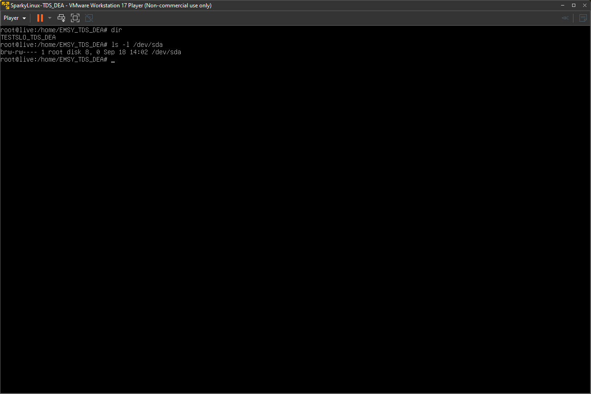 

Q11. Que signifie **sda** ? 

> C’est le nom par défaut que Linux donne aux disques détectés. Par exemple, le premier disque s’appelle /dev/sda, le deuxième /dev/sdb, etc.

Q12. Décrypter la réponse après avoir taper la commande `ls -l /dev/sda` -> voir résultat point 13.

> le "ls -l" sert a faire un listing avec l'option "l" les affichera les détail comme le type, permissions, propriétaire, groupe, dates et "/dev/sda" fait référence au premier disque dur détecté par Linux

Pour lancer l'installateur taper sudo sparkylinux-installer
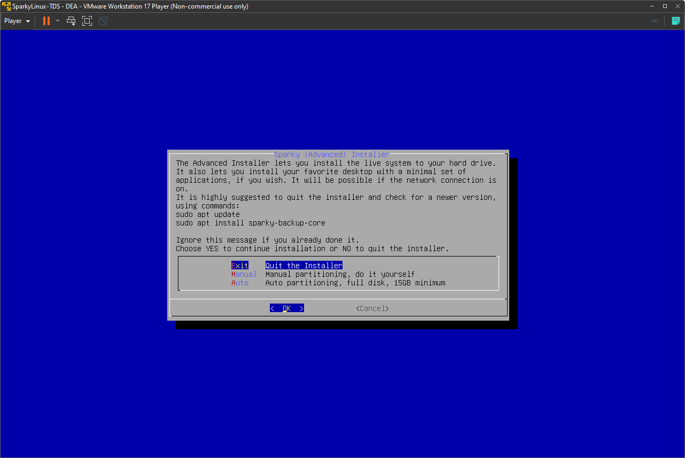

Q13. Quelle est la taille de disque minimum recommandée pour installer la distribution Sparky ?

> La taille minimal d'instalition et de 2Go comme indiquée sur le site
> 
https://wiki.sparkylinux.org/doku.php/minimum_system_requirements

Q14. A quoi sert la partition swap ? Est-ce que ce principe existe sur les OS Microsoft Windows ?
> La partition swap sert à utiliser une certaine quantitée de memoire allouer du disque comme memoire RAM dans le cas ou l'integralitée de la mêmoire vive et remplie, et sur Windows c'est l'equivalent à Pagefile.sys.

Q15. Quel format pourriez-vous utiliser pour la 3ème partition afin qu’elle soit également accessible depuis un OS Microsoft ? 
> On peut utiliser du exFAT ou du FAT32 pour que linux et windows puisse utiliser la partition.

Voici la configuration du partitionnement de notre VM.
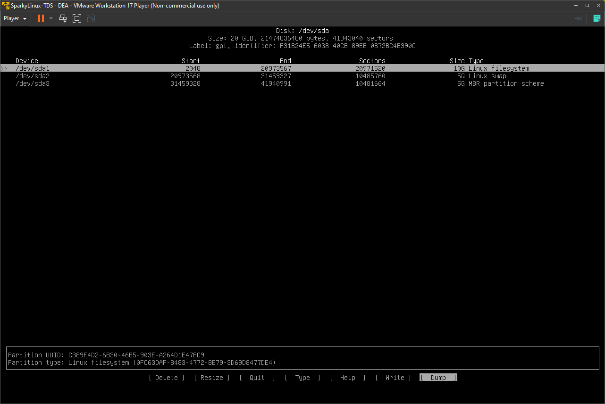

Q16. Durant l’installation, on vous demande deux noms d’utilisateur. A quoi correspondent-ils ?
> Lors de l’installation, nous avons eu deux noms : Host, qui correspond au nom de la machine, et User, qui se réfère à la personne qui utilise la machine

N: Après l’installation de Linux, prenez une capture d’écran du démarrage de votre système (GRUB).

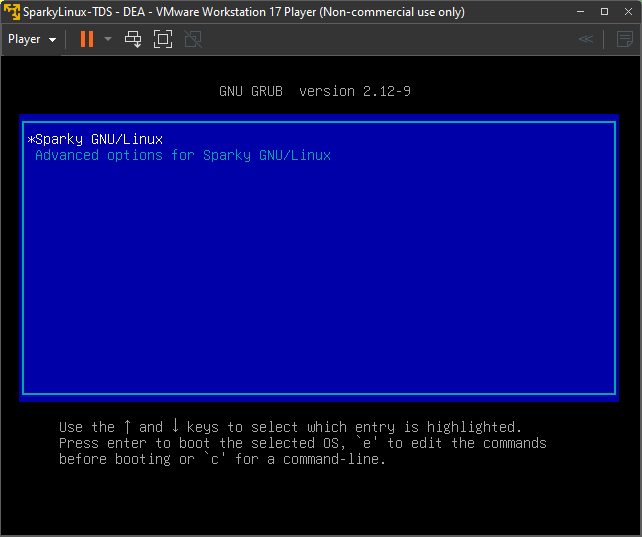

O: Trouvez la ou les lignes de commande permettant de changer le clavier (clavier suisse romand trouvable sous « German (Switzerland)) et procédez à la configuration du clavier. Changement de la disposition du clavier.
> Pour chager la disposition du clavier, on peut taper : sudo nano /ect/default/keyboard se qui nous ouvre le fichier de configuration du clavier, et on change les valeurs par defaut, par les valeur si dessous:
>Et ensuite redemarrer.

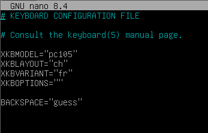

P: Testez si l’application « nano » est installée sur votre machine, tapez la commande : nano -version
> la commande exacte est : nano -V, nano -version ne fonctionne pas.
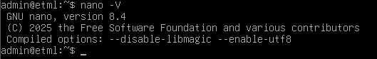

> On peut voir qu'il est intaller !

Q17: À quoi sert « nano » ?
>nano est un petit editeur de text en ligne de commande, comme vi mais plus simple d'utilisation, qui sert a éditer tout type de fichier avec du texte.

Q: Testez si l’application « git » est installée sur votre distribution, si ce n’est pas le cas installez un client git.

Q18: Comment savoir si « git » est déjà installé ?
>On peut faire la commande `git`, si la commande est reconnue git est installé, autrement git n'est pas installé.

Q19: Quelle(s) commande(s) utilisez-vous pour l’installer ?
>Pour installer il faut utiliser la commande `sudo apt install git`
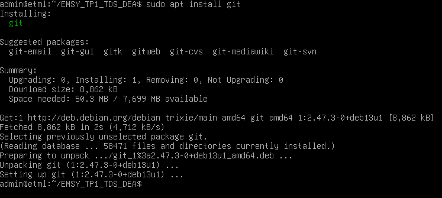

Q20: Que veut dire « apt » ?
>Advanced Package Tool (apt) est un gestionnaire de paquet sur Debian, qui permet d'intaller ou de désinstaller des programmes graçe a un répôt en ligne.

Q21: Est-ce que cette commande peut être utilisée sur toutes les distributions Linux ?
>Non, C'est uniquement sur les distribution linux sous debian. ex: Arch linux utilise pacman et Alpine Linux utilise apk.

R: Créez un sous-répertoire « EMSY_TP1_TDS-DEA » dans le répertoire de votre utilisateur. Attention : Ici on veut que l’utilisateur (vous) ait les droits de lecture, d’écriture et d’exécution.

Q22: Quel est le répertoire utilisateur ?
>C'est le dossier qui se trouve dans "/home/admin" "admin" et le nom d'utilisateur de notre machine, C'est ici on l'on peut stocker ou crée des fichiers et de pour voir le modifier sans le droit d'administrateur.

Q23: Quelles sont les commandes que vous allez utiliser ?
>Premièrement, se diriger dans notre dossier utilisateur en faisant "cd /home/admin".
>Crée un dossier avec cette commande "mkdir EMSY_TP1_TDS-DEA"
>Et se deplacer dedans avec "cd EMSY_TP1_TDS-DEA"

S: Dans ce répertoire, tapez la commande : git clone https://github.com/TimeDol/EMSY_TP1_Source.git

Q24: Qu’observez-vous dans votre répertoire ?
>Un dossier du nom de "EMSY_TP1_Source" c'est crée et à l'interieur se trouver le contenu du dépôt github cloné.

T: Editez le fichier source .c avec l’éditeur de texte « nano ». Réalisez un petit programme en C (par exemple de type « Hello world »).
>Nous avons realiser un Hello World en C. avec l'aide de nano.

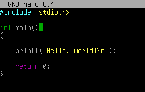

U. Vérifiez si le compilateur « gcc » est bien installé. Notez la version du logiciel.
>Pour ça nous avons taper "gcc -v"
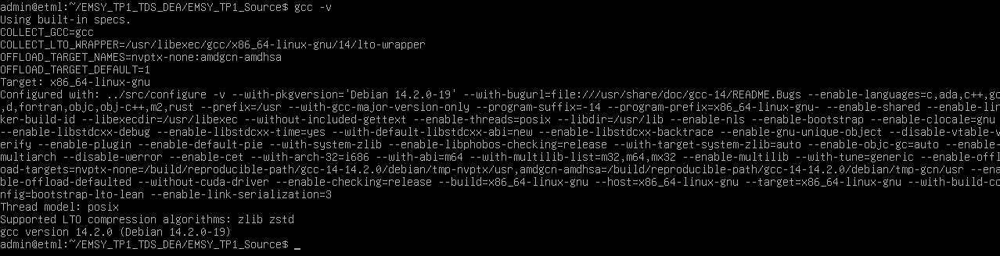
> la version du logiciel est la gcc 14.2.0.

Tapez les commandes suivantes : "gcc -Wall -o EMSY_TP1.o -c EMSY_TP1.c" et "gcc -o EMSY_TP1 EMSY_TP1.o"
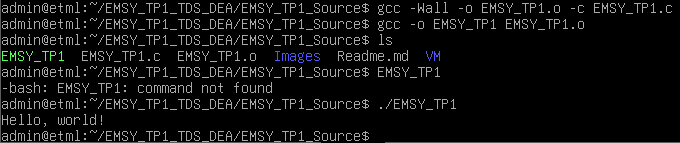

Q25: Quels sont les fichiers qui ont été générés ?
>Un fichier "EMSY_TP1.o" qui contient les données binaire de programme compilé:
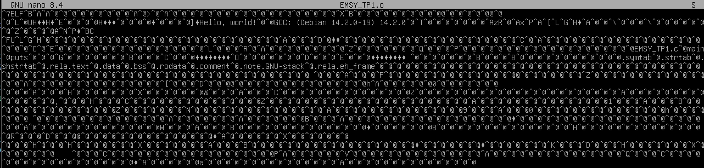

>Et un fichier executable par Linux "EMSY_TP1"

V. Entrez la commande suivante : ./EMSY_TP1
Q26: Que se passe-t-il ?
>Une fois executer, le programme nous revoie un "Hello World!"

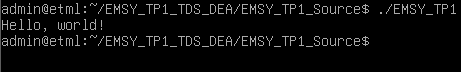

## Tips 

> $$Tips^1$$ : sortir de la VM -> appuyer simultanément sur `Ctrl` et `Alt` 

> $$Tips^2$$ : arrêter la VM proprement -> commande : `shutdown`

> $$Tips^3$$ : arrêter la VM pour cause de plantage -> commande : `halt` ou `poweroff`

> $$Tips^4$$ : [commande vi avec ses options](https://www.linuxtricks.fr/wiki/guide-de-sur-vi-utilisation-de-vi)

> $$Tips^5$$ : [éditer un fichier type markdown (.md)](https://ashki23.github.io/markdown-latex.html)

## Tips complementaires
> $$Tips^1$$ : Reinitialiser le mot de passe s'il est oublié :
> 1. Reboot la machine -> Dans le GRUB sélection la version sparky qu'on utilise (PAS APPUYER ENTER), une fois dessus appuyer sur la touche "e".
> 2. Dans les commandes, il faut chercher la commande qui commence par `linux /boot/vmlinuz-xxxx root=UUID=xxxx ro...`
> 3. On efface tout ce qui est marqué à partir de `ro` et on le substitue par `rw init=/bin/bash`
> 4. Ensuite sans faire enter, on redémarre la machine (Ctrl + X ou F10), en mode normal, PAS DE RECOVERY MODE !.
> 5. Une fois la machine redemarre, on verra un `#`, après ce caractère on tape la commande suivante : `passwd ton_nom_d'user` appuyer sur enter
> 6. Suite à ça la machine va nous demander un nouveau mot de passe, on crée un et on redemarre la machine.
> 7. Après ces étapes le mot de passe sera reinitialisé.
>
