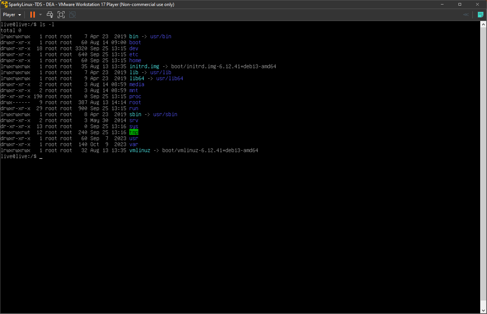

# TP1 - Installation Linux sur une VM - V0.1

## Groupe 

- TDS - DEA 

## But 

Cette manipulation a pour but d'installer une distribution linux [Sparky Linux](https://sparkylinux.org/) dans une machine virtuelle VMware Workstation Player, à l’aide d’une image disque (ISO).

## Materiels à disposition 

- VMware Workstation Player - V17
- Image disque (ISO) : sparkylinux-6.4-x86_64-minimalcli.iso

## Utilisation de VMware et de l'image ISO linux 

A. Lancez VMware Workstation Player (logiciel)  

B. Sélectionnez **Create a New Virtual Machine** 

C. Placez le fichier `.iso` dans une repertoire connu : 

`C:\VosInitiales\VM\ISO`

D. Indiquez le chemin d’accès de l’image iso comme indiqué sous l’image ci-dessous :

 

E. Choisir un nom d'OS : `Linux - Debian 11.x` 

 

F. Nommez la machine virtuelle : `SparkyLinux-VosInitiales` 

G. Creez un disque virtuel -> capcité : **20GB** 

> remarque$$^1$$ : cocher **store virtual disk a single file**

 

> remarque$$^2$$ : ci-dessous, la configuration de la VM 

 

H. Lancez la machine virtuelle : **Play virtual machine** 

## Lancement de l'image ISO (Linux - Live CD) 

G. Lancement du live CD : 

 

Shell Linux : 

 

> **ATTENTION** : par défaut, le clavier est configuré est **Clavier Americain**

Q1. disposition du clavier américain ?

> QWERTY

Q2. disposition du clavier suisse-romand ?

> QWERZ

Q3. disposition du le clavier français ? 

> AZERTY

H. Déplacez-vous à la **racine du système** en utilisant la commande suivante : `cd` 

> cd /

I. Affichez le contenu de la racine avec la commande : `ls –l`	

 

Q5. Que signifie l'option `-l` avec la commande `ls` 

> la commande ls de base sert à faire un listing du repertoir dans lequel on est, si on utilise l'option l (long) on verra des informations complentaires.

Q6. Décrypter la ligne où se trouve le répertoire **home**    

> Le « d » au début veut dire que c’est un dossier, le « r » signifie que l’on peut lire le contenu, le « w » signifie que l’on peut modifier le contenu et « x » signifie que l’on peut exécuter le contenu. Dans ce cas de la ligne « drwxr-xr-x », elle permet de dire que tout le monde peut accéder au répertoire et lire son contenu, mais seul le créateur peut le modifier.

>Le « 1 » après cette ligne décrit le nombre de liens physiques au dossier.

>Le premier « root » décrit le propriétaire du dossier.

>Le second « root » décrit le groupe propriétaire du dossier.

>Le « 60 » représente la taille en octets du contenu du dossier.

>Le « sep 18 13:47 » représente la date et l’heure de la dernière modification.

>Le « home » est le nom du dossier.

J. Créez un répertoire de travail nommé « EMSY_VosInitiales» dans quel dossier racine allez-vous le placer (justifiez votre réponse) et quelle commande allez-vous utiliser. 

> On va utiliser la commande "sudo su" pour passer en super utilisateur et pouvoir éditer le dossier home.

> Ensuite, on va utiliser la commande "cd home/" pour se déplacer dans le dossier home.

> Ensuite, on utilise "mkdir EMSY_TDS_DEA" pour créer un dossier dans le répertoire home.

> Nous avons choisi le répertoire home car il est décrit dans Linux comme un répertoire personnel.

Q7. Si vous créez un répertoire de travail (pour éditer/sauvegarder des fichiers), dans quelle **répertoire racine** vous vous placez ? 

Dans le répertorie home car ce répertoire est reserver pour des dossiers personnels.

K. Dans ce répertoire, créez un fichier texte que vous nommerez `TESTSLO_XXX_XXX` et éditez celui en écrivant un texte, exemple : "TP linux by XXX et XXX".
	Utiliser la commande `vi`

> votre commande ?! 

Q9. dans le répertoire `/home`, pouvez-vous éditez un fichier uniquement avec la commande `vi` 

> votre réponse ?!

Q10. Si vous éteignez la machine virtuelle et que vous la rallumez, est-ce que le répertoire créé ci-dessus existe toujours (justifiez votre réponse) ? 

> votre réponse ?!

L. Tapez la commande `ls -l /dev/sda` 

 

Q11. Que signifie **sda** ? 

> votre réponse ?!

Q12. Décrypter la réponse après avoir taper la commande `ls -l /dev/sda` -> voir résultat point 13.

> votre réponse ?!

## Tips 

> $$Tips^1$$ : sortir de la VM -> appuyer simultanément sur `Ctrl` et `Alt` 

> $$Tips^2$$ : arrêter la VM proprement -> commande : `shutdown`

> $$Tips^3$$ : arrêter la VM pour cause de plantage -> commande : `halt` ou `poweroff`

> $$Tips^4$$ : [commande vi avec ses options](https://www.linuxtricks.fr/wiki/guide-de-sur-vi-utilisation-de-vi)

> $$Tips^5$$ : [éditer un fichier type markdown (.md)](https://ashki23.github.io/markdown-latex.html)

